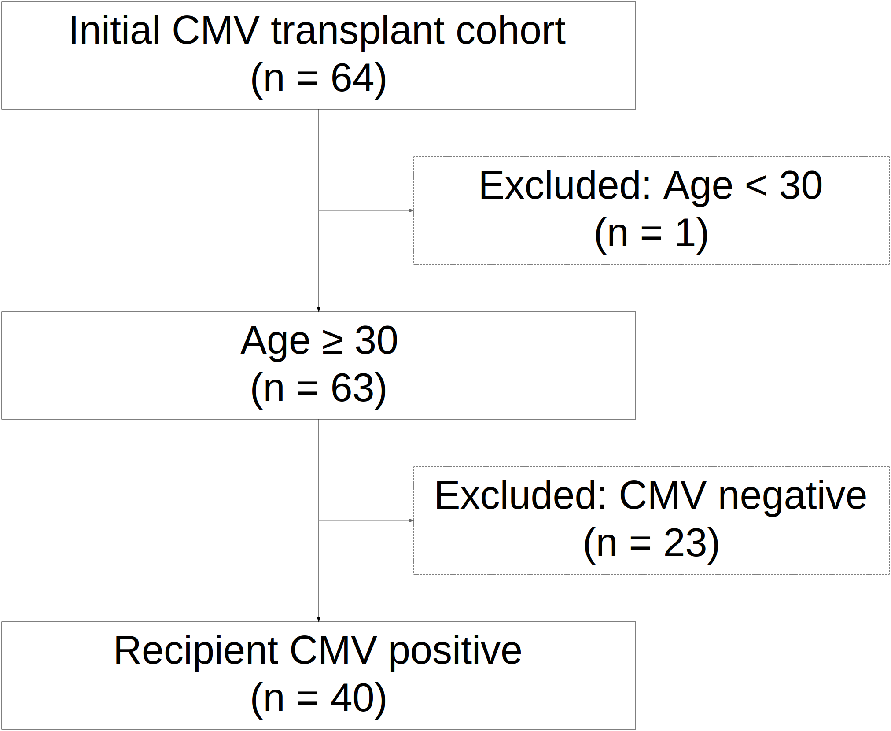

```{r, include = FALSE}
knitr::opts_chunk$set(
  collapse = TRUE,
  comment = "#>",
  fig.path = "man/figures/README-",
  out.width = "100%"
)
```

# strobe: Tools for STROBE-Style Inclusion and Exclusion Tracking with patient-level data

<!-- badges: start -->
<!-- badges: end -->

The `strobe` package provides tools for **tracking cohort inclusion/exclusion** in observational studies using a STROBE-inspired flow. STROBE (Strengthening the Reporting of Observational Studies in Epidemiology) is a widely adopted guideline for transparent reporting of cohort, case-control, and cross-sectional studies. Learn more at the official website: <https://www.strobe-statement.org/>.

The `strobe` package both applies filtering criteria to a patient-level data frame while tracking the number of patients excluded and included at each step.  The package can also print and/or save the final STROBE diagram for inclusion in a publication.

By logging each filtering step—conditions applied, number remaining, and number excluded—`strobe` helps ensure reproducibility, clarity, and publication-quality documentation of cohort derivation.


## Installation

You can install the development version of `strobe` from [GitHub](https://github.com/VagishHemmige/strobe) with:

```{r eval=FALSE}
# install.packages("devtools")
devtools::install_github("VagishHemmige/strobe")
```

## Example

_Note: The example below requires the `medicaldata` package. Install it with:_

```{r eval=FALSE}
install.packages("medicaldata")
```


We now create an SVG plot in R and then plot it.  Interactively, `the plot_strobe_diagram()` function can also directly create plots that can be viewed in the Rstudio viewer, but direct visualization in an .rmd file which has been knitted may cause formatting issues.
```{r strobe-example, eval = requireNamespace("medicaldata", quietly = TRUE), message = FALSE, warning = FALSE}
library(strobe)
library(medicaldata)
data(cytomegalovirus)

df <- strobe_initialize(cytomegalovirus, "Initial CMV transplant cohort")
df <- strobe_filter(df, "age >= 30", "Age ≥ 30", "Excluded: Age < 30")
df <- strobe_filter(df, "recipient.cmv == 1", "Recipient CMV positive", "Excluded: CMV negative")

get_strobe_log()
svg_file <- plot_strobe_diagram(export_file = "man/figures/strobe-diagram_vignette1_1.svg", 
                                incl_fontsize = 90, excl_fontsize = 90, 
                                lock_width_min = TRUE, 
                                incl_width_min = 20, excl_width_min = 15)

```

