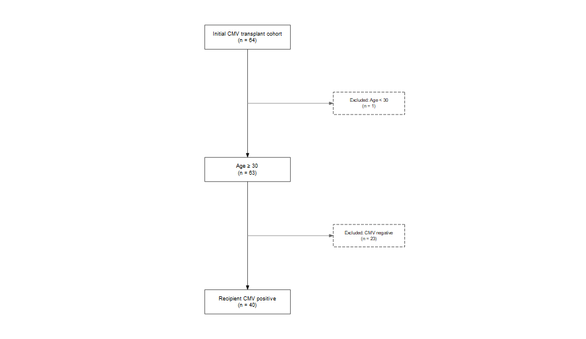

# strobe: Tools for STROBE-Style Inclusion and Exclusion Tracking with patient-level data

<!-- badges: start -->

<!-- badges: end -->

The **strobe** package provides tools for **tracking cohort
inclusion/exclusion** in observational studies using a STROBE-inspired
flow. STROBE (Strengthening the Reporting of Observational Studies in
Epidemiology) is a widely adopted guideline for transparent reporting of
cohort, case-control, and cross-sectional studies. Learn more at the
official website: <https://www.strobe-statement.org/>.

The **strobe** package both applies filtering criteria to a
patient-level data frame while tracking the number of patients excluded
and included at each step. The package can also print and/or save the
final STROBE diagram for inclusion in a publication.

By logging each filtering step—conditions applied, number remaining, and
number excluded—**strobe** helps ensure reproducibility, clarity, and
publication-quality documentation of cohort derivation.

## Installation

You can install the development version of `strobe` from
[GitHub](https://github.com/VagishHemmige/strobe) with:

``` r
# install.packages("devtools")
devtools::install_github("VagishHemmige/strobe")
```

## Example

*Note: The example below requires the `medicaldata` package. Install it
with:*

``` r
install.packages("medicaldata")
```

``` r
library(strobe)
library(medicaldata)
data(cytomegalovirus)

df <- strobe_initialize(cytomegalovirus, "Initial CMV transplant cohort")
df <- strobe_filter(df, "age >= 30", "Age ≥ 30", "Excluded: Age < 30")
df <- strobe_filter(df, "recipient.cmv == 1", "Recipient CMV positive", "Excluded: CMV negative")

get_strobe_log()
#> # A tibble: 3 × 7
#>   id    parent inclusion_label         exclusion_reason filter remaining dropped
#>   <chr> <chr>  <chr>                   <chr>            <chr>      <int>   <int>
#> 1 start <NA>   Initial CMV transplant… <NA>             <NA>          64      NA
#> 2 step1 start  Age ≥ 30                Excluded: Age <… age >…        63       1
#> 3 step2 step1  Recipient CMV positive  Excluded: CMV n… recip…        40      23
plot_strobe_diagram()
```


