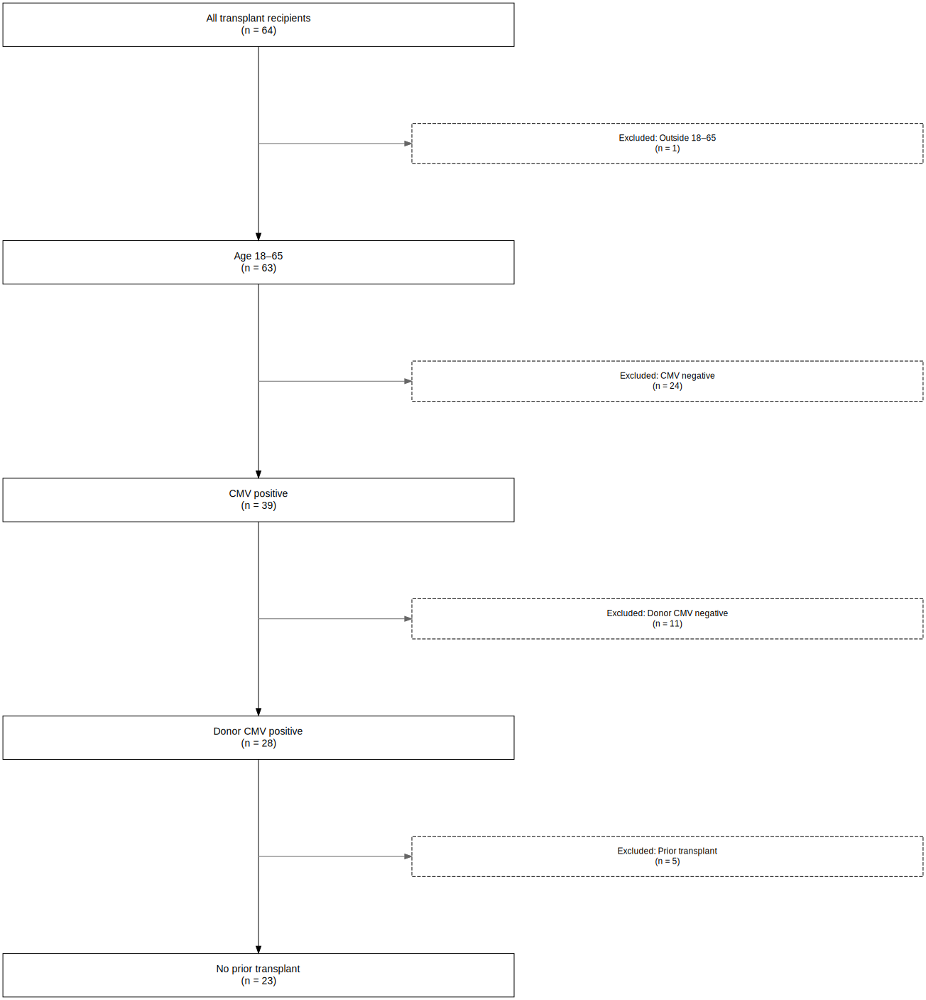
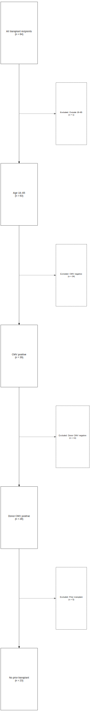
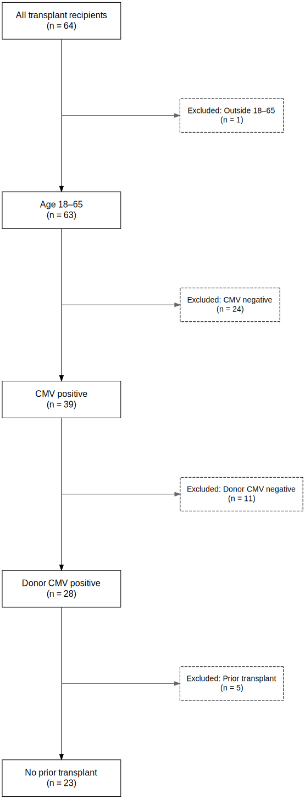
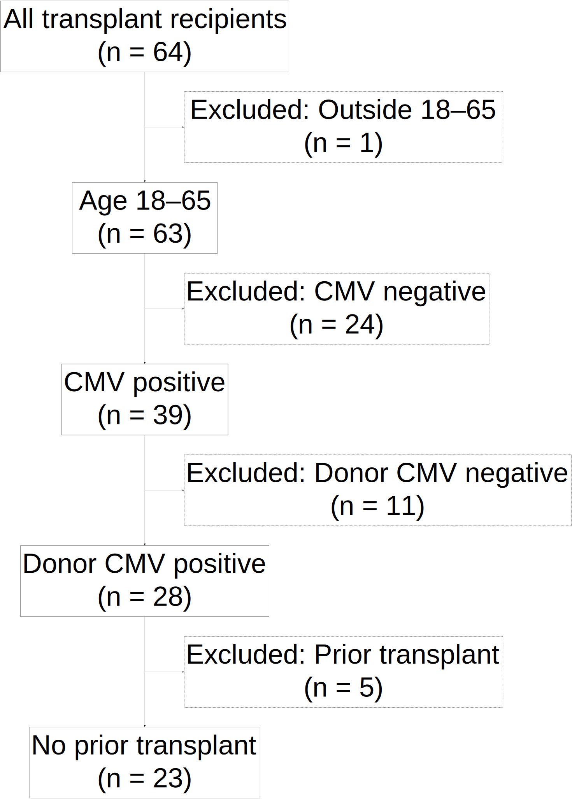
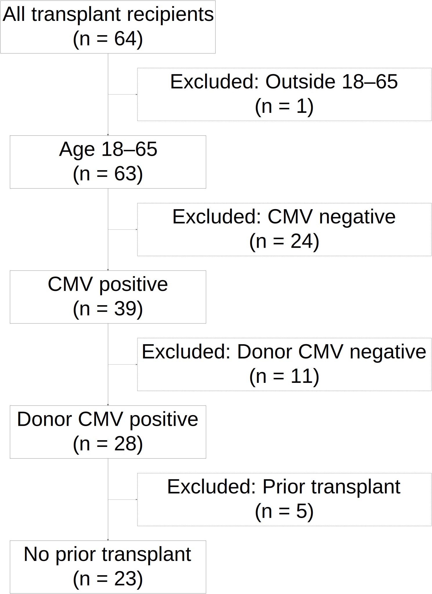
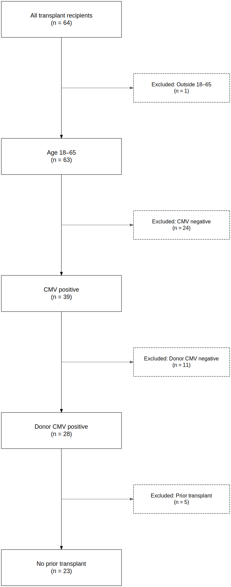
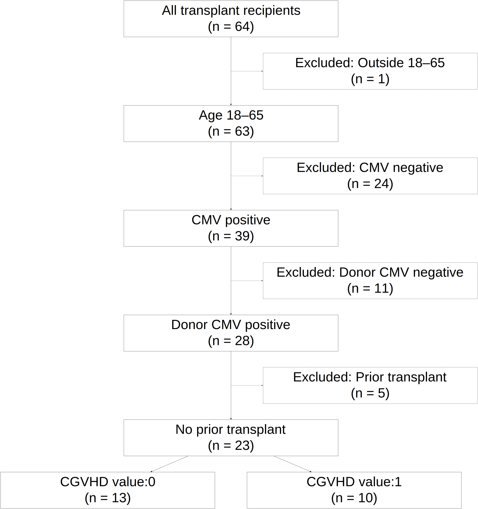
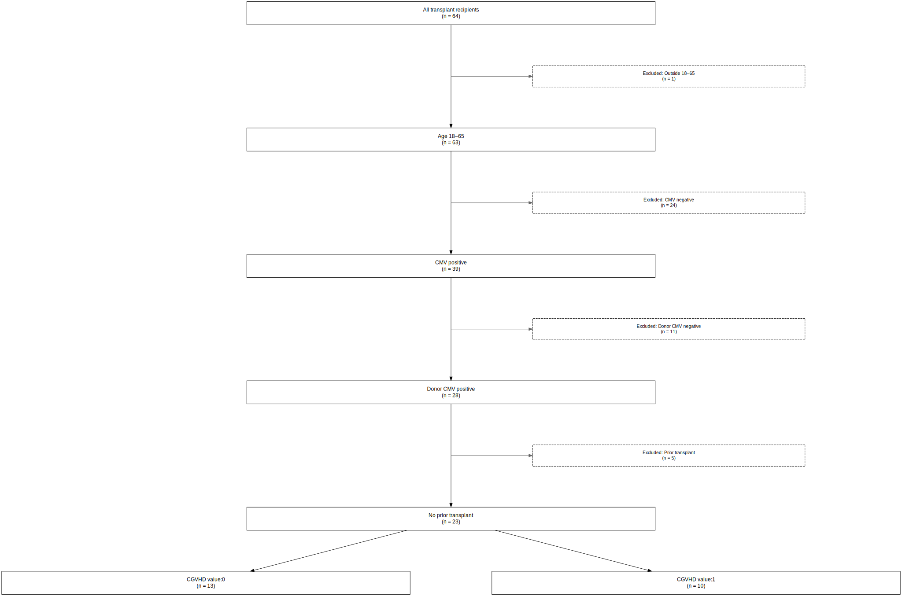

```{r setup, include = FALSE}
knitr::opts_chunk$set(
  collapse = TRUE,
  comment = "#>"
)

# Save figures into man/figures, which persists through R CMD build and is pkgdown-compatible
fig_dir <- file.path("man", "figures")
if (!dir.exists(fig_dir)) {
  dir.create(fig_dir, recursive = TRUE)
}

# Helper function to create the full path for writing files
create_fig_path <- function(filename) {
  file.path(fig_dir, filename)
}
```

## Introduction

The STROBE (Strengthening the Reporting of Observational Studies in Epidemiology) statement encourages the transparent reporting of observational studies. One important element is a flow diagram that documents how the study population was selected.

The `strobe` package provides tools to generate reproducible STROBE-style diagrams from your cohort-building process. This vignette shows how to use `plot_strobe_diagram()` to visualize cohort selection, and how to adjust visual parameters for publication-ready output.

## Setup

```{r}
library(strobe)
library(dplyr)
library(medicaldata)

data(cytomegalovirus)

cytomegalovirus_df <- cytomegalovirus %>%
  strobe_initialize("All transplant recipients") %>%
  strobe_filter("age >= 18 & age <= 65", "Age 18–65", "Excluded: Outside 18–65") %>%
  strobe_filter("recipient.cmv == 1", "CMV positive", "Excluded: CMV negative") %>%
  strobe_filter("donor.cmv == 1", "Donor CMV positive", "Excluded: Donor CMV negative") %>%
  strobe_filter("prior.transplant == 0", "No prior transplant", "Excluded: Prior transplant")
```

## Basic Diagram

```{r, out.width="50%", fig.align="center"}
fig_path <- create_fig_path("strobe-diagram_basic.svg")
plot_strobe_diagram(export_file = fig_path)
knitr::include_graphics("man/figures/strobe-diagram_basic.svg")
```

## Wider Boxes

```{r, out.width="50%", fig.align="center"}
fig_path <- create_fig_path("strobe-diagram_wide.svg")
plot_strobe_diagram(incl_width_min = 10, excl_width_min = 10, export_file = fig_path)

```

## Taller Boxes

```{r, out.width="50%", fig.align="center"}
fig_path <- create_fig_path("strobe-diagram_tall.svg")
plot_strobe_diagram(incl_height = 5, excl_height = 5, export_file = fig_path)

```

## Locked Box Sizes

```{r, out.width="50%", fig.align="center"}
fig_path <- create_fig_path("strobe-diagram_locked.svg")
plot_strobe_diagram(lock_width_min = TRUE, lock_height = TRUE, export_file = fig_path)
knitr::include_graphics("man/figures/strobe-diagram_locked.svg")
```

## Font Sizes

```{r, out.width="50%", fig.align="center"}
fig_path <- create_fig_path("strobe-diagram_fonts.svg")
plot_strobe_diagram(incl_fontsize = 16, excl_fontsize = 14, export_file = fig_path)

```

## Large Fonts for Slides

```{r, out.width="50%", fig.align="center"}
fig_path <- create_fig_path("strobe-diagram_slidefonts.svg")
plot_strobe_diagram(incl_fontsize = 150, excl_fontsize = 150, export_file = fig_path)

```

## Large Fonts + Size Adjustments

```{r, out.width="50%", fig.align="center"}
fig_path <- create_fig_path("strobe-diagram_slidefonts_tuned.svg")
plot_strobe_diagram(incl_fontsize = 150, excl_fontsize = 150,
                    incl_width_min = 20, excl_width_min = 30,
                    export_file = fig_path)

```

## Fully Tuned Example

```{r, out.width="50%", fig.align="center"}
fig_path <- create_fig_path("strobe-diagram_fullytuned.svg")
plot_strobe_diagram(incl_width_min = 5, excl_width_min = 4,
                    incl_height = 1.5, excl_height = 1.2,
                    incl_fontsize = 18, excl_fontsize = 16,
                    lock_width_min = TRUE, lock_height = TRUE,
                    export_file = fig_path)

```

## Terminal Branching

```{r, out.width="50%", fig.align="center"}
cytomegalovirus_df <- create_terminal_branch(cytomegalovirus_df, variable = "cgvhd", label_prefix = "CGVHD value:")

fig_path <- create_fig_path("strobe-diagram_terminal.svg")
plot_strobe_diagram(incl_fontsize = 90, excl_fontsize = 90,
                    lock_width_min = TRUE, incl_width_min = 20, excl_width_min = 20,
                    export_file = fig_path)

```

## Troubleshooting Layout

If boxes are overlapping or lines look incorrect:

### Try Locking Width/Height

```{r, out.width="50%", fig.align="center"}
fig_path <- create_fig_path("strobe-diagram_troubleshoot.svg")
plot_strobe_diagram(lock_width_min = TRUE,
                    incl_width_min = 15, excl_width_min = 10,
                    export_file = fig_path)

```

### Use Manual Line Breaks

Use `\n` in inclusion/exclusion text:

```{r, eval=FALSE}
strobe_filter(
  condition = "...",
  inclusion_label = "Eligible recipients\nwith CMV+ donors",
  exclusion_reason = "Excluded:\nCMV- donors"
)
```
