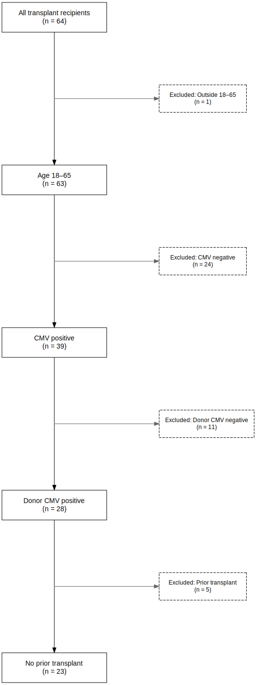
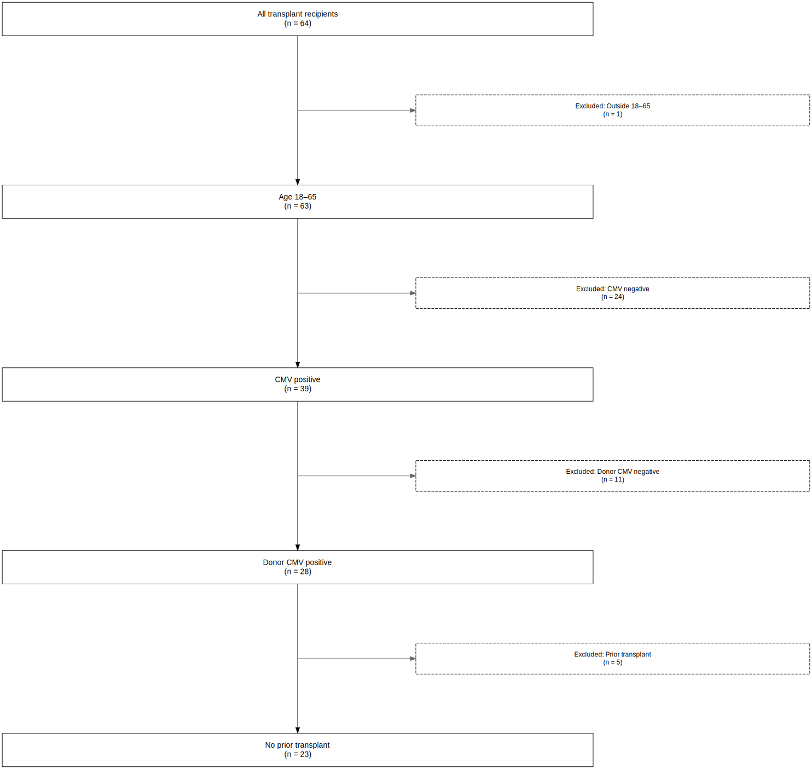
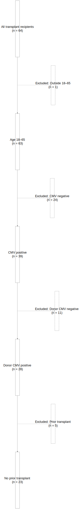

```{r, include = FALSE}
knitr::opts_chunk$set(
  collapse = TRUE,
  comment = "#>"
)
```


## Introduction

The STROBE (Strengthening the Reporting of Observational Studies in Epidemiology) statement encourages the transparent reporting of observational studies. One important element is a flow diagram that documents how the study population was selected.

The strobe package provides tools to generate reproducible STROBE-style diagrams from your cohort-building process. This vignette shows how to use plot_strobe_diagram() to visualize cohort selection, and how to adjust visual parameters for publication-ready output.

The plot_strobe_diagram function assumes you’ve already built a STROBE derivation log using strobe_initialize() and strobe_filter(), and converts the derivation log into a STROBE figure using the DiagrammeR package in R.

## Setup
We start by creating a STROBE-compatible log, again using the cytomegalovirus data from the `medicaldata` package:

```{r, warning=FALSE}
library(strobe)
library(dplyr)
library(medicaldata)

data(cytomegalovirus)

cytomegalovirus_df<-cytomegalovirus %>%
  strobe_initialize("All transplant recipients") %>%
  strobe_filter("age >= 18 & age <= 65", "Age 18–65", "Excluded: Outside 18–65") %>%
  strobe_filter("recipient.cmv == 1", "CMV positive", "Excluded: CMV negative") %>%
  strobe_filter("donor.cmv == 1", "Donor CMV positive", "Excluded: Donor CMV negative") %>%
  strobe_filter("prior.transplant == 0", "No prior transplant", "Excluded: Prior transplant")
```


## Basic Usage

The most basic STROBE diagram can be produced by simply calling the `plot_strobe_diagram` function in interactive mode: 

```{r eval=FALSE}
plot_strobe_diagram()
```


While this will work in interactive mode, it typically will *not* work well when knitting an R Markdown file.  In that case, we recommend exporting to a file and then directly incorporating the exported file in the R markdown file.

```{r, out.width="50%", fig.align="center"}
getwd()
dir.exists("man/figures")  # Should return TRUE

svg_file_2_1 <-plot_strobe_diagram(export_file = "strobe-diagram_vignette2_1.svg")


```


The `strobe` package supports .png and .svg formats. The SVG format can easily be edited in an SVG editor such as [SVG-Edit](https://svgedit.netlify.app/editor/index.html) or a downloadable SVG editor such as [Inkscape](https://inkscape.org/release/).


## Controlling Box Size

If your text is getting truncated or looks cramped, adjust the box dimensions.

### Wider boxes

We can use the `incl_width_min` option to set the minimum width of the inclusion boxes, and the `excl_width_min` box to set the minimum width of the exclusion boxes.  

We first demonstrate the use of the minimum width setting:

```{r, out.width="50%", fig.align="center"}
svg_file_2_2a <-plot_strobe_diagram(incl_width_min = 10, excl_width_min = 10, 
                                   export_file = "strobe-diagram_vignette2_2a.svg")
knitr::include_graphics("strobe-diagram_vignette2_2a.svg")

```

### Taller boxes

We can use the `incl_height` option to set the height of the inclusion boxes, and the `excl_height` box to set the minimum height of the exclusion boxes.  

```{r, out.width="50%", fig.align="center"}
svg_file_2_2b <-plot_strobe_diagram(incl_height = 5, excl_height = 5, 
                                   export_file = "strobe-diagram_vignette2_2b.svg")
knitr::include_graphics("strobe-diagram_vignette2_2b.svg")
```


### Locking Size Across Boxes

The `DiagrammeR` package, by default, takes input sizes as suggestions and may choose to ignore them.  If you want to force the use of the sizes that you provide, use the `lock_width_min` or `lock_height` options:

```{r, out.width="50%", fig.align="center"}
svg_file_2_3 <-plot_strobe_diagram(lock_width_min = TRUE, 
                                   lock_height = TRUE, 
                                   export_file = "strobe-diagram_vignette2_3.svg")
knitr::include_graphics("strobe-diagram_vignette2_3.svg")
```


While not helpful in this case, it may be helpful when you have multi-line text in some nodes but not others, but want to ensure uniformity of size.

## Adjusting Font Size

You can separately control font sizes for inclusion and exclusion boxes:

```{r, out.width="50%", fig.align="center"}
svg_file_2_4 <-plot_strobe_diagram(incl_fontsize = 16, 
                                   excl_fontsize = 14, 
                                   export_file = "strobe-diagram_vignette2_4.svg")
knitr::include_graphics("strobe-diagram_vignette2_4.svg")
```


Use larger fonts for presentation or slide decks:

```{r, out.width="50%", fig.align="center"}
svg_file_2_5a <-plot_strobe_diagram(incl_fontsize = 150, 
                                   excl_fontsize = 150, 
                                   export_file = "strobe-diagram_vignette2_5a.svg")
knitr::include_graphics(svg_file_2_5a)
```


The use of larger fonts will likely require some trial and error with box sizing for optimal results:

```{r, out.width="50%", fig.align="center"}
svg_file_2_5b <-plot_strobe_diagram(incl_fontsize = 150, 
                                   excl_fontsize = 150,
                                   incl_width_min = 20, excl_width_min = 30, 
                                   export_file = "strobe-diagram_vignette2_5b.svg")
knitr::include_graphics(svg_file_2_5b)
```


## Combining Size and Font Adjustments

Here’s an example with many settings tuned:

```{r, out.width="50%", fig.align="center"}
svg_file_2_6 <-plot_strobe_diagram(
  incl_width_min = 5,
  excl_width_min = 4,
  incl_height = 1.5,
  excl_height = 1.2,
  incl_fontsize = 18,
  excl_fontsize = 16,
  lock_width_min = TRUE,
  lock_height = TRUE,
  export_file = "strobe-diagram_vignette2_6.svg"
)
knitr::include_graphics(svg_file_2_6)
```


## Accounting for terminal branching

You don't have to do anything special to account for terminal branching when plotting--the `plot_strobe_diagram` function is able to handle the details based on the structure of the strobe flow:

```{r, out.width="50%", fig.align="center"}

#Add a terminal branch
cytomegalovirus_df<-create_terminal_branch(cytomegalovirus_df, variable = "cgvhd", label_prefix="CGVHD value:")

svg_file_2_7 <- plot_strobe_diagram(export_file = "strobe-diagram_vignette2_7.svg", 
                                incl_fontsize = 90, excl_fontsize = 90, 
                                lock_width_min = TRUE, 
                                incl_width_min = 20, excl_width_min = 20)

```


## Troubleshooting Layout

If boxes are overlapping or lines look incorrect:

### Try Locking Width/Height
The plot_strobe_diagram's underlying dependence on DiagrammeR means that the suggested widths and heights may not be followed precisely unless the `lock_width_min` or `lock_height` options are used:

```{r, out.width="50%", fig.align="center"}
svg_file_2_8 <-plot_strobe_diagram(lock_width_min = TRUE,
                                   incl_width_min = 15,
                                   excl_width_min = 10,
                                   export_file = "strobe-diagram_vignette2_8.svg")

```


### Use Fewer Words or Manual Line Breaks

Use \n in labels to manually split long lines. Example:

```{r eval=FALSE}
strobe_filter(
  condition = "...",
  inclusion_label = "Eligible recipients\nwith CMV+ donors",
  exclusion_reason = "Excluded:\nCMV- donors"
)
```


This often improves appearance more than tweaking sizes alone.

## Summary

`plot_strobe_diagram()` gives you fine-grained control over the appearance of STROBE cohort diagrams. You can:

- Tune box dimensions
- Control font sizes
- Lock box sizes for uniform appearance
- Export to PNG or SVG for publication use or, in the case of SVG, further editing

These tools help make your derivation logic transparent, reproducible, and ready for review.
